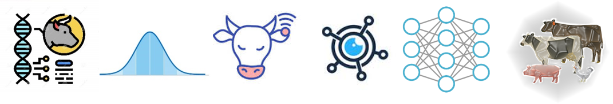

{width=100%}  

Anderson is an statistical geneticist, currently working as Research Associate at [Dr. Rosa's lab](https://www.gjmrosa.org/) (University of Wisconsin-Madison). His research focuses on developing and applying statistical models and machine learning methods for the analysis of quantitative traits in livestock animals.   

[**MY CV**](https://drive.google.com/file/d/1KU2M9bNDexYJUpxmdIxSRpTOOw-85lSJ/view?usp=sharing)

**Reach me at:**

[{width=10%}](https://www.linkedin.com/in/anderson-alves-69aa70212/)[{width=10%}](https://github.com/alvesand)[{width=10%}](https://www.researchgate.net/profile/Anderson-Alves-2)  

