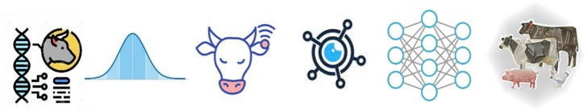

{width=100%}  

I am a statistical geneticist, currently working as Research Associate at [Dr. Rosa's lab](https://www.gjmrosa.org/) (University of Wisconsin-Madison). I am broadly interested in the application and development of efficient statistical learning methods for the analysis of livestock data, with a focus on the genomics and phenomics of complex traits in different domestic species. My research agenda centers on conciliating molecular information, sensor-enabled data, and efficient statistical learning methods for improving animal production, reproduction, welfare and health, supporting better farming efficiency.  

**You can find my CV [here](https://drive.google.com/file/d/1VMhU_3dazeR3e1MSGOYlpuyqbezl4-Uy/view?usp=share_link).**

**Reach me at:**

[{width=10%}](https://www.linkedin.com/in/anderson-alves-69aa70212/)[{width=10%}](https://github.com/alvesand)[{width=10%}](https://www.researchgate.net/profile/Anderson-Alves-2)[{width=10%}](https://www.instagram.com/oakalves/)  

